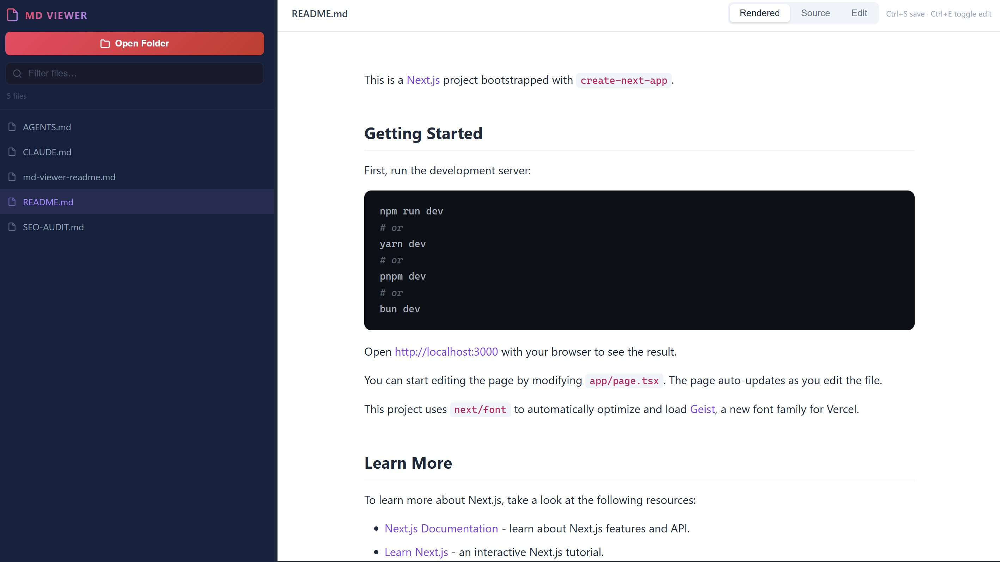

# MD Viewer

A single-file, offline Markdown viewer and editor that runs entirely in the browser — no server, no install, no dependencies to manage. Open `md-viewer.html` directly in Chrome or Edge and you're ready to go.

---

## Requirements

- **Chrome or Edge** (any recent version)
- Firefox is **not supported** — it lacks the File System Access API that powers folder reading and file saving

---

## Features

### Folder Browser
- Click **Open Folder** to grant access to a local directory
- The sidebar lists all `.md` files found in that folder, sorted alphabetically
- A file count is shown below the search box
- The sidebar remembers its width across sessions (stored in `localStorage`)

### File Search / Filter
- A search box appears after opening a folder
- Type to instantly filter the file list by filename (case-insensitive)

### Three View Modes

Switch between modes using the toolbar buttons or keyboard shortcuts:

| Mode | What it shows |
|------|--------------|
| **Rendered** | Fully rendered Markdown with styled headings, tables, blockquotes, images, and syntax-highlighted code blocks |
| **Source** | Raw Markdown source with syntax highlighting (via highlight.js, Atom One Dark theme) |
| **Edit** | Plain-text editor (monospace font, no spell-check) for editing the file directly |

### Rendered Markdown Support
The viewer renders full GitHub-Flavored Markdown (GFM), including:
- Headings (H1–H6) with a styled hierarchy
- Bold, italic, strikethrough
- Unordered and ordered lists
- Task lists (checkboxes)
- Blockquotes (left-bordered, purple-tinted)
- Inline code and fenced code blocks with syntax highlighting
- Tables with hover row highlighting
- Images (responsive, rounded corners)
- Horizontal rules
- Hyperlinks

### Syntax Highlighting
- Code blocks in Rendered mode are highlighted by [highlight.js](https://highlightjs.org/) using the **Atom One Dark** theme
- The Source mode also highlights the raw Markdown syntax

### In-Browser File Editing & Saving
- Switch to **Edit** mode to modify the current file in a textarea
- Unsaved changes are tracked — a **Save** button appears when there are pending edits
- Saving writes the changes directly back to the file on disk (no download/upload loop)
- After saving, the button briefly shows a green **Saved!** confirmation
- Navigating away from a dirty file prompts a confirmation dialog to prevent accidental data loss
- The browser's unload event also warns if there are unsaved changes

### Keyboard Shortcuts

| Shortcut | Action |
|----------|--------|
| `Ctrl+S` / `Cmd+S` | Save the file (Edit mode only) |
| `Ctrl+E` / `Cmd+E` | Toggle between Edit and Rendered mode |
| `Ctrl+R` / `Cmd+R` | Switch to Rendered mode |

### Status Bar
A persistent status bar at the bottom shows:
- Current filename
- Active mode (Rendered / Source / Edit)
- Line count
- Character count

### Resizable Sidebar
- Drag the divider between the sidebar and the content area to resize
- The chosen width is saved to `localStorage` and restored on next open

---

## Design

- Dark sidebar + light content area — easy on the eyes for long reading sessions
- Brand colors: red (`#e94560`) and purple (`#a78bfa`) accents on a deep navy background
- Content area uses a clean white background with a max-width of 780px for comfortable reading
- Fully responsive down to 640px (sidebar narrows, padding reduces)

---

## How It Works (Technical)

- Uses the browser's **File System Access API** (`showDirectoryPicker`, `createWritable`) — this is why Chrome/Edge are required
- Markdown rendering: [marked.js v9](https://marked.js.org/) with GFM and line-break support enabled
- Syntax highlighting: [highlight.js v11.9](https://highlightjs.org/)
- No build step, no framework, no bundler — everything is in a single `.html` file

---

## Limitations

- Only reads `.md` files from the **top level** of the selected folder (no recursive subfolder scanning)
- Requires a one-time browser permission grant per folder per session
- Firefox is unsupported (File System Access API not available)

## Screenshot

